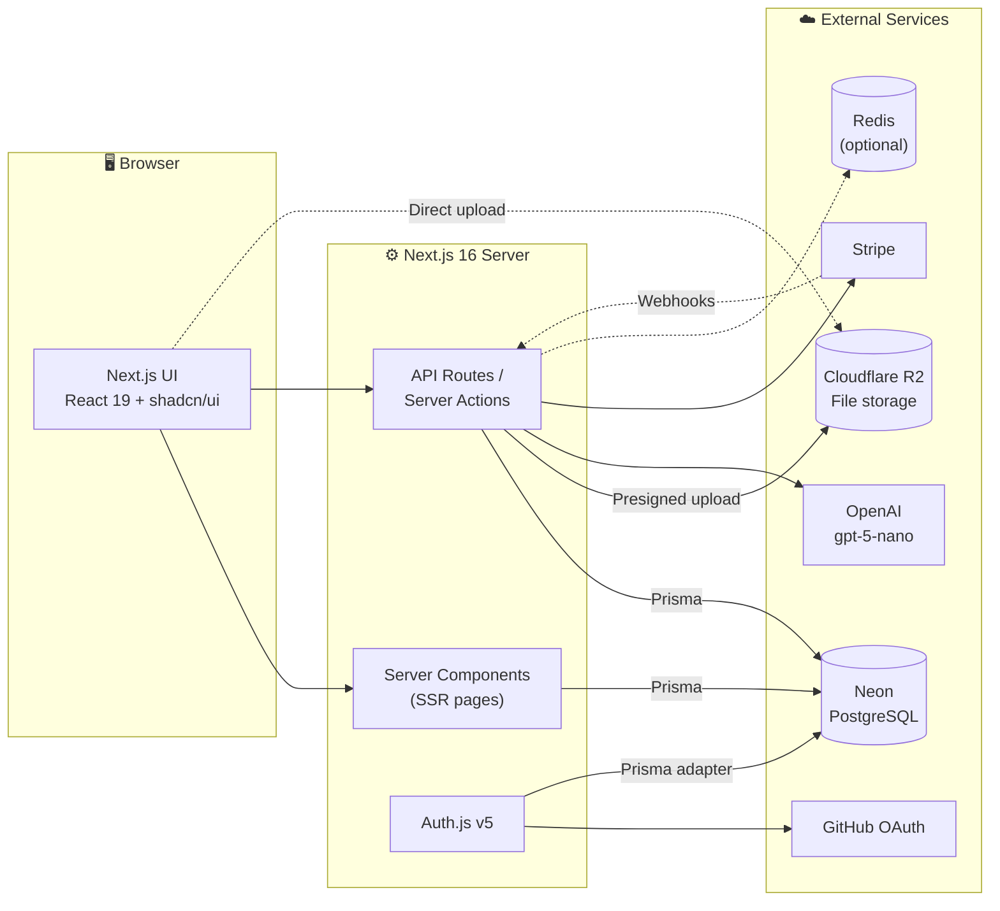
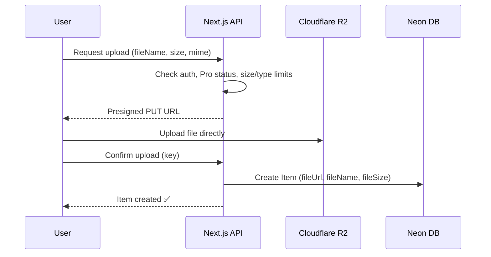
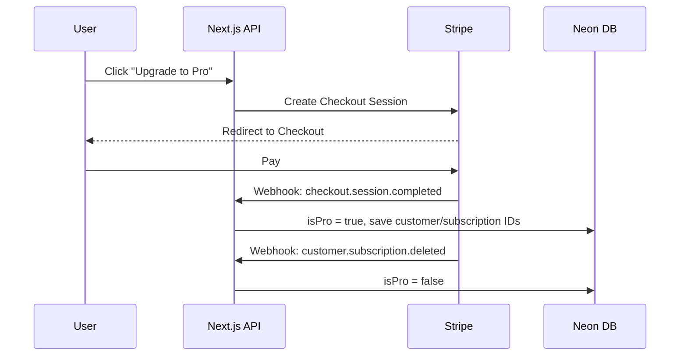
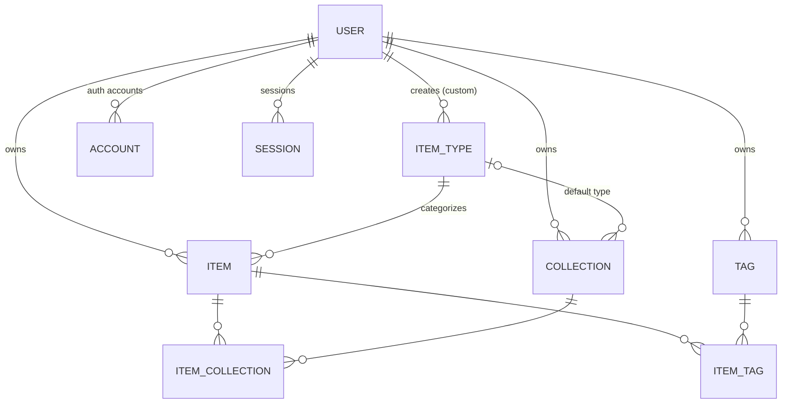

# 🗂️ DevStash — Project Overview

> **One fast, searchable, AI-enhanced hub for all your dev knowledge & resources.**

---

## Table of Contents

1. [Problem](#1-problem)
2. [Target Users](#2-target-users)
3. [Features](#3-features)
4. [Tech Stack](#4-tech-stack)
5. [Architecture](#5-architecture)
6. [Data Model](#6-data-model)
7. [Prisma Schema](#7-prisma-schema)
8. [Routes](#8-routes)
9. [Monetization](#9-monetization)
10. [UI / UX](#10-ui--ux)
11. [Development Rules](#11-development-rules)
12. [Open Questions](#12-open-questions)
13. [Reference Links](#13-reference-links)

---

## 1. Problem

Developers keep their essentials scattered across too many places:

| What | Where it usually lives |
| --- | --- |
| Code snippets | VS Code, Notion |
| AI prompts | Old chat threads |
| Context files | Buried in project folders |
| Useful links | Browser bookmarks |
| Docs | Random folders |
| Commands | `.txt` files, bash history |
| Project templates | GitHub Gists |

The result is **context switching, lost knowledge, and inconsistent workflows**.

**DevStash** brings all of it into one place that is fast to search, fast to capture, and enhanced by AI.

---

## 2. Target Users

| Persona | Primary need |
| --- | --- |
| 🧑‍💻 **Everyday Developer** | Quickly grab snippets, prompts, commands and links |
| 🤖 **AI-first Developer** | Store prompts, context files, workflows, system messages |
| 🎓 **Content Creator / Educator** | Store code blocks, explanations, course notes |
| 🏗️ **Full-stack Builder** | Collect patterns, boilerplates, API examples |

---

## 3. Features

### A. Items & Item Types

Every piece of saved content is an **Item**, and every Item has a **Type**.

The app ships with seven **system types** that cannot be edited or deleted. **Custom types** (user-created) come later as a Pro feature.

| Type | Content kind | Icon (Lucide) | Color | Plan |
| --- | --- | --- | --- | --- |
| Snippet | Text | `Code` |  `#3b82f6` blue | Free |
| Prompt | Text | `Sparkles` |  `#8b5cf6` purple | Free |
| Command | Text | `Terminal` |  `#f97316` orange | Free |
| Note | Text | `StickyNote` |  `#fde047` yellow | Free |
| Link | URL | `Link` |  `#10b981` emerald | Free |
| File | File | `File` |  `#6b7280` gray | **Pro** |
| Image | File | `Image` |  `#ec4899` pink | **Pro** |

- **Content kinds:** `TEXT` (markdown / code), `URL` (links), `FILE` (uploaded to R2).
- **Type URLs** use the plural slug: `/items/snippets`, `/items/prompts`, `/items/links`, etc.
- Items are **created and opened in a drawer** for fast access without leaving the current page.

### B. Collections

- Users group items into **Collections** (e.g. *React Patterns*, *Context Files*, *Python Snippets*).
- A collection can hold **items of any type**.
- An item can belong to **many collections** (many-to-many via a join table).
  - Example: a React snippet can live in both *React Patterns* and *Interview Prep*.
- Users can see which collections an item belongs to and add/remove it from several at once.

### C. Search

Search across **titles, content, tags and types**.

- **Free:** basic search (title / tag / type filtering).
- **Pro (future):** consider full-text search with Postgres `tsvector` and ranking; possibly semantic search later.

### D. Authentication

- Email + password (credentials, passwords hashed with bcrypt/argon2)
- GitHub OAuth

### E. Core Features

- ⭐ Favorite items and collections
- 📌 Pin items to the top
- 🕒 Recently used items
- 📥 Import code from a file
- 📝 Markdown editor for text types, with syntax highlighting
- 📎 File upload for File / Image types (Pro)
- 📤 Export data — JSON / ZIP (Pro)
- 🌙 Dark mode by default, light mode optional

### F. AI Features (Pro)

Powered by **OpenAI `gpt-5-nano`**.

| Feature | Description |
| --- | --- |
| 🏷️ Auto-tag suggestions | Suggest tags based on an item's content |
| 📄 Summaries | Short summary of long notes, files or prompts |
| 💡 Explain This Code | Plain-language explanation of a snippet or command |
| ✨ Prompt Optimizer | Rewrite a prompt to be clearer and more effective |

---

## 4. Tech Stack

| Layer | Choice | Notes |
| --- | --- | --- |
| Framework | **Next.js 16** + **React 19** | App Router, SSR pages with dynamic client components |
| Language | **TypeScript** | End-to-end type safety |
| Backend | Next.js API routes / Server Actions | Items CRUD, file uploads, AI calls |
| Database | **Neon** (serverless PostgreSQL) | Cloud-hosted, with branching for dev |
| ORM | **Prisma 7** | Uses `prisma.config.ts` + Neon driver adapter |
| Caching | Redis *(optional, later)* | e.g. Upstash if needed |
| File storage | **Cloudflare R2** | S3-compatible; stores File/Image uploads |
| Auth | **Auth.js (NextAuth v5)** | Credentials + GitHub, Prisma adapter |
| AI | **OpenAI** `gpt-5-nano` | Pro features only |
| Payments | **Stripe** | Subscriptions (monthly / yearly) |
| Styling | **Tailwind CSS v4** + **shadcn/ui** | Lucide icons |
| Repo | Single codebase | Less overhead |

### Prisma 7 setup notes

Prisma 7 changed how connections are configured:

- The connection URL **no longer goes in `schema.prisma`**; it moves to `prisma.config.ts`.
- Generator is now `prisma-client` (not `prisma-client-js`) with an explicit `output` path; import the client from that generated path, **not** `@prisma/client`.
- A **driver adapter is required** — for Neon, use `@prisma/adapter-neon`.
- Use two env vars: a **pooled** URL for the app and a **direct (unpooled)** URL for CLI/migrations.

```ts
// prisma.config.ts
import "dotenv/config";
import { defineConfig, env } from "prisma/config";

export default defineConfig({
  schema: "prisma/schema.prisma",
  migrations: { path: "prisma/migrations" },
  datasource: {
    url: env("DATABASE_URL_UNPOOLED"), // direct connection for migrations
  },
});
```

```ts
// src/lib/db.ts
import { PrismaClient } from "@/generated/prisma/client";
import { PrismaNeon } from "@prisma/adapter-neon";

const adapter = new PrismaNeon({ connectionString: process.env.DATABASE_URL! });

const globalForPrisma = globalThis as unknown as { prisma?: PrismaClient };

export const prisma = globalForPrisma.prisma ?? new PrismaClient({ adapter });

if (process.env.NODE_ENV !== "production") globalForPrisma.prisma = prisma;
```

### Environment variables

```bash
# Database (Neon)
DATABASE_URL=              # pooled — used by the app
DATABASE_URL_UNPOOLED=     # direct — used by Prisma CLI / migrations

# Auth.js
AUTH_SECRET=
AUTH_GITHUB_ID=
AUTH_GITHUB_SECRET=

# Cloudflare R2
R2_ACCOUNT_ID=
R2_ACCESS_KEY_ID=
R2_SECRET_ACCESS_KEY=
R2_BUCKET_NAME=
R2_PUBLIC_URL=

# OpenAI
OPENAI_API_KEY=

# Stripe
STRIPE_SECRET_KEY=
STRIPE_WEBHOOK_SECRET=
STRIPE_PRICE_MONTHLY=
STRIPE_PRICE_YEARLY=
NEXT_PUBLIC_STRIPE_PUBLISHABLE_KEY=
```

---

## 5. Architecture



### File upload flow (Pro)



### Stripe subscription flow



---

## 6. Data Model

### Entity relationships



### Design decisions & cleanup vs. original notes

| Change | Why |
| --- | --- |
| `contentType` is an enum `TEXT \| URL \| FILE` | The notes list three kinds of content (text, url, file) but the draft field only allowed `text \| file` |
| Added `slug` to `ItemType` | Powers routes like `/items/snippets` |
| Added `lastUsedAt` to `Item` | Needed for the "Recently used" feature |
| Added `fileMimeType` to `Item` | Needed to validate uploads and render images/files correctly |
| `Tag` is scoped to a user, with an explicit `ItemTag` join table | Tags are personal; many-to-many between items and tags |
| Added `password` to `User` | Required for email/password sign-in (stored hashed) |
| Added `stripeCurrentPeriodEnd` to `User` | Lets you check Pro access without calling Stripe on every request |
| Added Auth.js tables (`Account`, `Session`, `VerificationToken`) | Required by the Auth.js Prisma adapter |
| System types have `userId = null` and `isSystem = true` | Shared across all users, seeded once |
| `onDelete: Cascade` on user-owned data | Deleting a user or item cleans up joins automatically |

---

## 7. Prisma Schema

```prisma
// prisma/schema.prisma

generator client {
  provider = "prisma-client"
  output   = "../src/generated/prisma"
}

datasource db {
  provider = "postgresql"
  // URL lives in prisma.config.ts (Prisma 7)
}

// ─────────────────────────────────────────────
// Enums
// ─────────────────────────────────────────────

enum ContentType {
  TEXT
  URL
  FILE
}

// ─────────────────────────────────────────────
// Auth.js (NextAuth v5) models
// ─────────────────────────────────────────────

model User {
  id            String    @id @default(cuid())
  name          String?
  email         String?   @unique
  emailVerified DateTime?
  image         String?
  password      String? // hashed; null for OAuth-only users

  // Billing
  isPro                  Boolean   @default(false)
  stripeCustomerId       String?   @unique
  stripeSubscriptionId   String?   @unique
  stripeCurrentPeriodEnd DateTime?

  createdAt DateTime @default(now())
  updatedAt DateTime @updatedAt

  accounts    Account[]
  sessions    Session[]
  items       Item[]
  collections Collection[]
  itemTypes   ItemType[]
  tags        Tag[]
}

model Account {
  userId            String
  type              String
  provider          String
  providerAccountId String
  refresh_token     String?
  access_token      String?
  expires_at        Int?
  token_type        String?
  scope             String?
  id_token          String?
  session_state     String?

  createdAt DateTime @default(now())
  updatedAt DateTime @updatedAt

  user User @relation(fields: [userId], references: [id], onDelete: Cascade)

  @@id([provider, providerAccountId])
  @@index([userId])
}

model Session {
  sessionToken String   @unique
  userId       String
  expires      DateTime

  createdAt DateTime @default(now())
  updatedAt DateTime @updatedAt

  user User @relation(fields: [userId], references: [id], onDelete: Cascade)

  @@index([userId])
}

model VerificationToken {
  identifier String
  token      String
  expires    DateTime

  @@id([identifier, token])
}

// ─────────────────────────────────────────────
// DevStash models
// ─────────────────────────────────────────────

model ItemType {
  id          String      @id @default(cuid())
  name        String // "Snippet"
  slug        String // "snippets" → /items/snippets
  icon        String // Lucide icon name, e.g. "Code"
  color       String // hex, e.g. "#3b82f6"
  contentType ContentType
  isSystem    Boolean     @default(false)
  isProOnly   Boolean     @default(false)

  userId String? // null for system types
  user   User?   @relation(fields: [userId], references: [id], onDelete: Cascade)

  items              Item[]
  defaultCollections Collection[] @relation("CollectionDefaultType")

  createdAt DateTime @default(now())
  updatedAt DateTime @updatedAt

  @@unique([userId, slug])
  @@index([userId])
}

model Item {
  id          String      @id @default(cuid())
  title       String
  description String?
  contentType ContentType

  // TEXT
  content  String? // markdown / code; null for files
  language String? // optional, for syntax highlighting

  // URL
  url String?

  // FILE
  fileUrl      String? // R2 URL / key
  fileName     String? // original filename
  fileSize     Int? // bytes
  fileMimeType String?

  isFavorite Boolean   @default(false)
  isPinned   Boolean   @default(false)
  lastUsedAt DateTime?

  userId String
  user   User   @relation(fields: [userId], references: [id], onDelete: Cascade)

  itemTypeId String
  itemType   ItemType @relation(fields: [itemTypeId], references: [id])

  collections ItemCollection[]
  tags        ItemTag[]

  createdAt DateTime @default(now())
  updatedAt DateTime @updatedAt

  @@index([userId])
  @@index([userId, itemTypeId])
  @@index([userId, isPinned])
  @@index([userId, lastUsedAt])
  @@index([itemTypeId])
}

model Collection {
  id          String  @id @default(cuid())
  name        String // "React Hooks", "Prototype Prompts"
  description String?
  isFavorite  Boolean @default(false)

  // Used to color the card when the collection has no items yet
  defaultTypeId String?
  defaultType   ItemType? @relation("CollectionDefaultType", fields: [defaultTypeId], references: [id], onDelete: SetNull)

  userId String
  user   User   @relation(fields: [userId], references: [id], onDelete: Cascade)

  items ItemCollection[]

  createdAt DateTime @default(now())
  updatedAt DateTime @updatedAt

  @@index([userId])
  @@index([defaultTypeId])
}

model ItemCollection {
  itemId       String
  collectionId String
  addedAt      DateTime @default(now())

  item       Item       @relation(fields: [itemId], references: [id], onDelete: Cascade)
  collection Collection @relation(fields: [collectionId], references: [id], onDelete: Cascade)

  @@id([itemId, collectionId])
  @@index([collectionId])
}

model Tag {
  id   String @id @default(cuid())
  name String

  userId String
  user   User   @relation(fields: [userId], references: [id], onDelete: Cascade)

  items ItemTag[]

  createdAt DateTime @default(now())

  @@unique([userId, name])
}

model ItemTag {
  itemId String
  tagId  String

  item Item @relation(fields: [itemId], references: [id], onDelete: Cascade)
  tag  Tag  @relation(fields: [tagId], references: [id], onDelete: Cascade)

  @@id([itemId, tagId])
  @@index([tagId])
}
```

### Seed: system item types

```ts
// prisma/seed.ts
const systemTypes = [
  { name: "Snippet", slug: "snippets", icon: "Code",       color: "#3b82f6", contentType: "TEXT", isProOnly: false },
  { name: "Prompt",  slug: "prompts",  icon: "Sparkles",   color: "#8b5cf6", contentType: "TEXT", isProOnly: false },
  { name: "Command", slug: "commands", icon: "Terminal",   color: "#f97316", contentType: "TEXT", isProOnly: false },
  { name: "Note",    slug: "notes",    icon: "StickyNote", color: "#fde047", contentType: "TEXT", isProOnly: false },
  { name: "Link",    slug: "links",    icon: "Link",       color: "#10b981", contentType: "URL",  isProOnly: false },
  { name: "File",    slug: "files",    icon: "File",       color: "#6b7280", contentType: "FILE", isProOnly: true  },
  { name: "Image",   slug: "images",   icon: "Image",      color: "#ec4899", contentType: "FILE", isProOnly: true  },
] as const;
// Upsert each with isSystem: true and userId: null
```

> ⚠️ Postgres treats `NULL`s as distinct in unique constraints, so `@@unique([userId, slug])` won't stop duplicate system types. Make the seed idempotent (look up by `slug` where `userId IS NULL` before creating).

---

## 8. Routes

| Route | Purpose |
| --- | --- |
| `/` | Marketing / landing page |
| `/sign-in`, `/sign-up` | Auth |
| `/dashboard` | Collections grid + recent / pinned items |
| `/items/[type]` | All items of a type, e.g. `/items/snippets` |
| `/collections` | All collections |
| `/collections/[id]` | Items in a collection |
| `/search?q=` | Search results |
| `/settings` | Profile, theme, export |
| `/settings/billing` | Plan & Stripe customer portal |
| `/api/auth/[...nextauth]` | Auth.js handlers |
| `/api/uploads` | Presigned R2 upload URLs |
| `/api/ai/*` | Tag suggestions, summaries, explain, prompt optimizer |
| `/api/webhooks/stripe` | Stripe webhooks |

Individual items open in a **drawer** over the current page (optionally reflected in the URL, e.g. `?item=<id>`, so they're shareable and survive refresh).

---

## 9. Monetization

Freemium model.

| | **Free** | **Pro** — $8/mo or $72/yr |
| --- | --- | --- |
| Items | 50 total | Unlimited |
| Collections | 3 | Unlimited |
| System types | All except File & Image | All |
| File & Image uploads | ❌ | ✅ |
| Custom types | ❌ | ✅ *(later)* |
| Search | Basic | Basic *(full-text later)* |
| AI auto-tagging | ❌ | ✅ |
| AI summaries | ❌ | ✅ |
| AI code explanation | ❌ | ✅ |
| AI prompt optimizer | ❌ | ✅ |
| Export (JSON / ZIP) | ❌ | ✅ |
| Priority support | ❌ | ✅ |

The yearly plan works out to **25% off** ($6/mo).

### Development mode

Build the Pro foundation now (flags, checks, Stripe wiring), but **let all users access everything during development**. Centralize the gating in one place so it's easy to switch on:

```ts
// src/lib/plan.ts
export const FREE_LIMITS = { items: 50, collections: 3 } as const;

const ENFORCE_PLANS = process.env.ENFORCE_PLANS === "true";

export function hasProAccess(user: { isPro: boolean }) {
  if (!ENFORCE_PLANS) return true; // everyone is Pro during development
  return user.isPro;
}
```

Enforce limits **on the server** (API routes / server actions), not just in the UI.

---

## 10. UI / UX

### General

- Modern, minimal, developer-focused
- **Dark mode by default**, light mode optional
- Clean typography, generous whitespace
- Subtle borders and shadows
- Syntax highlighting for code blocks (e.g. Shiki)
- Inspiration: [Notion](https://www.notion.so), [Linear](https://linear.app), [Raycast](https://www.raycast.com)

### Layout

```
┌──────────────────────────────────────────────────────────────┐
│  🔍 Search…                                  [+ New]  (👤)   │
├────────────────┬─────────────────────────────────────────────┤
│  SIDEBAR       │  MAIN                                       │
│                │                                             │
│  Types         │  Collections                                │
│  </> Snippets  │  ┌──────────┐ ┌──────────┐ ┌──────────┐     │
│  ✨ Prompts    │  │ React    │ │ Prompts  │ │ Context  │     │
│  >_ Commands   │  │ Patterns │ │ Library  │ │ Files    │     │
│  📝 Notes      │  │ (blue bg)│ │(purple)  │ │ (gray)   │     │
│  🔗 Links      │  └──────────┘ └──────────┘ └──────────┘     │
│  📄 Files  PRO │                                             │
│  🖼️ Images PRO │  Pinned / Recent items                      │
│                │  ┌─────────────┐ ┌─────────────┐            │
│  Collections   │  ┃ useDebounce │ ┃ git reset…  │            │
│  • React…      │  ┃ blue border │ ┃ orange bdr  │            │
│  • Prompts…    │  └─────────────┘ └─────────────┘            │
│                │                                             │
│  [«] collapse  │                    ┌──────────────────────┐ │
│                │                    │ ITEM DRAWER →        │ │
└────────────────┴────────────────────┴──────────────────────┘─┘
```

- **Sidebar** (collapsible): item types linking to `/items/[type]`, plus latest collections.
- **Main:** grid of collection cards. Each card's **background color** comes from the item type it contains most of (falls back to `defaultTypeId` when empty).
- **Item cards** show below collections with a **border color** matching their type.
- **Items open in a drawer** for quick view and edit.

### Type colors & icons

Icons come from [Lucide](https://lucide.dev/icons) (bundled with shadcn/ui).

| Type | Lucide icon | Color |
| --- | --- | --- |
| Snippet | [`Code`](https://lucide.dev/icons/code) | `#3b82f6` |
| Prompt | [`Sparkles`](https://lucide.dev/icons/sparkles) | `#8b5cf6` |
| Command | [`Terminal`](https://lucide.dev/icons/terminal) | `#f97316` |
| Note | [`StickyNote`](https://lucide.dev/icons/sticky-note) | `#fde047` |
| File | [`File`](https://lucide.dev/icons/file) | `#6b7280` |
| Image | [`Image`](https://lucide.dev/icons/image) | `#ec4899` |
| Link | [`Link`](https://lucide.dev/icons/link) | `#10b981` |

> 💡 Yellow `#fde047` is very light — use dark text on it and check contrast in light mode.

### Responsive

- Desktop-first, but usable on mobile
- Sidebar becomes a drawer (shadcn `Sheet`) on small screens

### Micro-interactions

- Smooth transitions
- Hover states on cards
- Toast notifications for actions (shadcn `Sonner`)
- Loading skeletons (shadcn `Skeleton`)
- *Nice-to-have:* `⌘K` command palette (shadcn `Command`) for search and quick-create — fits the Raycast/Linear feel

---

## 11. Development Rules

> 🚫 **Never use `prisma db push` or change the database structure directly.**

All schema changes go through migrations:

```bash
# Development: create + apply a migration
npx prisma migrate dev --name <descriptive_name>

# Production: apply existing migrations only
npx prisma migrate deploy
```

Other conventions:

- All data access is scoped by `userId` — never trust client-supplied ownership.
- Validate all input with a schema library (e.g. Zod) on the server.
- Plan/limit checks live in `src/lib/plan.ts` and run server-side.
- Use Neon branches for dev/preview databases so migrations can be tested before prod.

---

## 12. Open Questions

- **Search:** is Postgres full-text search enough, or is semantic (embedding) search worth it later?
- **File limits:** max file size and allowed MIME types for uploads?
- **Downgrade behavior:** what happens to a Pro user's files, extra items and collections if they cancel? (Read-only is a common choice.)
- **Custom types:** can users pick any Lucide icon and color? Which content kinds can they use?
- **Tags vs. AI tags:** should AI suggestions be auto-applied or require confirmation?
- **Redis:** is caching actually needed at launch, or defer until there's a measured bottleneck?
- **Sharing:** will items/collections ever be shareable publicly or with teams?

---

## 13. Reference Links

| Area | Link |
| --- | --- |
| Next.js | https://nextjs.org/docs |
| React | https://react.dev |
| Prisma 7 docs | https://www.prisma.io/docs |
| Prisma 7 upgrade guide | https://www.prisma.io/docs/guides/upgrade-prisma-orm/v7 |
| Prisma config reference | https://www.prisma.io/docs/orm/v7/reference/prisma-config-reference |
| Neon + Prisma | https://neon.com/docs/guides/prisma |
| Auth.js (NextAuth v5) | https://authjs.dev |
| Auth.js Prisma adapter | https://authjs.dev/getting-started/adapters/prisma |
| Cloudflare R2 | https://developers.cloudflare.com/r2/ |
| OpenAI API | https://platform.openai.com/docs |
| Stripe Billing | https://docs.stripe.com/billing |
| Tailwind CSS v4 | https://tailwindcss.com/docs |
| shadcn/ui | https://ui.shadcn.com |
| Lucide icons | https://lucide.dev/icons |
